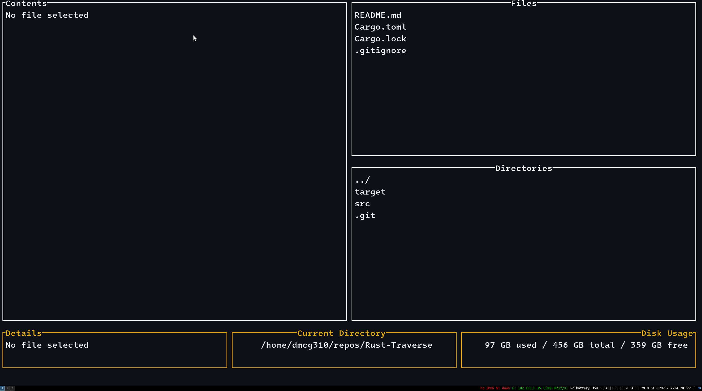

# Rust-Traverse

Rust traverse is a terminal based file explorer. It is inspired by the [NNN](https://github.com/jarun/nnn) file manager. It uses [Ratatui](https://github.com/tui-rs-revival/ratatui) for the terminal UI, with Crossterm for the terminal backend.

> To traverse or not to traverse?



## Features

- [x] Full CRUD operations on files and directories.
- [x] Move and copy files and directories.
- [x] Keyboard shortcuts for navigation and operations, to make sure you don't have to leave the keyboard.
- [x] Traverse directly to a directory by typing its path.
- [x] Configurable.
- [x] Extract tar.gz, or zip archives.
- [x] Bookmarks for your favourite directories.
- [x] Fuzzy finder for files in your current directory.
- [x] Preview files in the terminal.
- [x] Blazingly fast.

## Installation

### From source

1. Install [Rust](https://www.rust-lang.org/tools/install).
2. Clone the repository.
3. Run `cargo build --release`.
4. The binary will be in `target/release/rt`.
5. Add the binary to your path.

### From Binary

1. Download the binary from the releases page.
2. `chmod +x rt` (linux only) within the same directory as it, to make it executable.
3. Move the resulting binary to your path.

## Usage

Run `rt` in your terminal.

### Keyboard Shortcuts

#### Navigation

- `ESC` or `q`: Quit the application.
- `1`: Select the Files pane.
- `2`: Select the Directories pane.
- `j`: Select the next item in the current pane.
- `k`: Select the previous item in the current pane.

#### File and Directory Operations

- `n`: Create a new file or directory, depending on the current pane.
- `CTRL + d`: Delete the selected file or directory, (to bin).
- `r`: Rename the selected file or directory.
- `f`: Navigate to a directory using a relative or absolute path.
- `x`: Extract the selected archive, to the current directory.

#### Move/Copy Operations

- `c`: Append the selected file or directory to the move/copy buffer.
- `p`: Opens the move/copy buffer menu, (enter on any option is in relation to your current directory).

#### Fuzzy Finder Operations

- `w`: Toggle fzf.
- `CTRL + n`: 'Next' item in results.
- `CTRL + p`: 'Previous' item in results.

#### Bookmark Operations

- `b`: Shows bookmarks menu.
- `z`: Add current directory to bookmarks.
- `CTRL + n`: 'Next' bookmark in menu.
- `CTRL + p`: 'Previous' bookmark in menu.

#### Help

- `?`: Shows help menu.

## Configuration

The configuration file is located at `<config-dir>/traverse/config.txt`. The default configuration is as follows:

```
show_hidden=false
excluded_directories=.git,.idea,.vscode,target
```

The excluded directories are directories that will not be searched when using the FZF.
The bookmarks file is located at `<config-dir>/traverse/bookmarks`.
